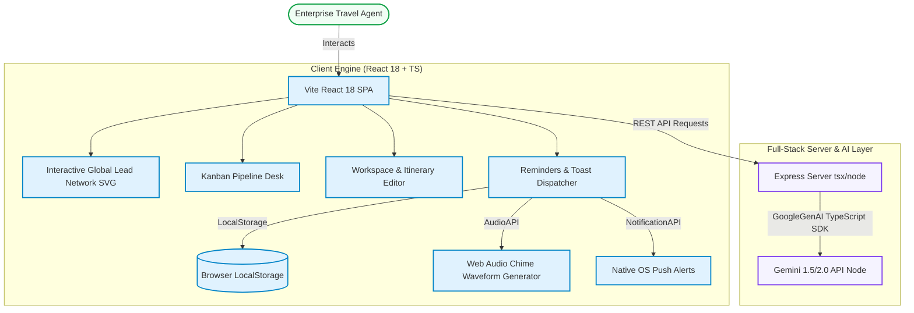

# TravelGPT ✈️🔮
### B2B Enterprise Travel Operations & Customer Experience Management Suite
> **Designed & Built by [Parita Dave](https://github.com/paritadave)**
>
> Live App Preview: [travel-gpt-three.vercel.app](https://travel-gpt-three.vercel.app/)

---

## 🌌 Overview

**TravelGPT** is a comprehensive, production-ready, full-stack B2B SaaS platform engineered for modern travel agencies and enterprise-grade tour operators. By merging powerful real-time analytics, interactive geographical mapping, automated follow-up triggers, and generative AI features, TravelGPT elevates agent productivity and transforms customer booking lifecycles.

---

## 🏗️ Platform Architecture

TravelGPT uses a dual-engine architecture designed for separation of concerns, high-density visualization, and responsive client-side state transitions.

### Visual Architecture Flowchart

```
                 +-------------------------------------------------+
                 |                Enterprise User                  |
                 +-----------------------+-------------------------+
                                         |
                                         v
                 +-----------------------+-------------------------+
                 |            SPA Client-Side View (Vite)          |
                 +----+------------------+--------------------+----+
                      |                  |                    |
                      v                  v                    v
         +------------+---------+  +-----+------+  +----------+----------+
         | Interactive SVG Map  |  | Lead Board |  | Workspace Customizer|
         | (Flightpath Vectors) |  |  (Kanban)  |  |  & AI Planner Node  |
         +------------+---------+  +-----+------+  +----------+----------+
                      |                  |                    |
                      v                  v                    v
         +------------+------------------+--------------------+----+
         |                 Client React 18 Engine & Hooks          |
         |  - localStorage (Reminders Persistence)                 |
         |  - Web Audio Context (Gentle chime cues)                |
         |  - Notification API (Native browser alerts)             |
         +-------------------------------+-------------------------+
                                         |
                       [Secure HTTP REST / Proxied API]
                                         |
                                         v
         +-------------------------------+-------------------------+
         |                 Express Node.js Middleware              |
         +-------------------------------+-------------------------+
                                         |
                                         v
         +-------------------------------+-------------------------+
         |                  Gemini Pro API Core                    |
         |               (@google/genai SDK Integration)           |
         +---------------------------------------------------------+
```

### 🧬 High-Level Mermaid Block Diagram



---

## ✨ Key Capabilities

1. **Interactive Global Lead Network Map**
   - High-fidelity visual network showing interactive geographical flightpaths originating from the **Paris HQ** directly to deterministic coordinate targets globally.
   - Micro-interactions include hover indicators, pulse states, pipeline density legends, and direct clicks to load customer workspace records.

2. **Enterprise Lead Board (Kanban Desk)**
   - Complete CRUD tracking of digital travel inquiries, qualified opportunities, and booked packages.
   - Dynamic sorting, filtering, and data export directly to standard Excel-compliant CSV files.

3. **Follow-up Reminders & Alerts (Designed for follow-up persistence)**
   - Custom **"Remind me"** trigger directly built on lead items.
   - Intelligent countdown scheduling engine matching immediate testing metrics (10 seconds) up to custom date-time inputs.
   - Staggered toast message dispatch with sound feedback compiled programmatically using browser **Web Audio API** (harmonic frequency progression).
   - Full support for **native browser desktop push notifications**.

4. **Workspace and Itinerary Customizer**
   - Rich interactive itinerary editing panels, live state synchronization, and bespoke note updates.
   - Automated hand-off and assignment using the **Lead Assignment Manager** selector supporting direct hand-offs between Human Experts and AI Copilots.

---

## 🛠️ Technology Stack

- **Frontend Core**: [React 18](https://react.dev/) + [TypeScript](https://www.typescriptlang.org/)
- **Bundler**: [Vite](https://vite.dev/) (Speed-oriented build pipelines)
- **Styling Utility**: [Tailwind CSS v4](https://tailwindcss.com/) (Tailwind-native imports and transitions)
- **Interactive Vectors**: [Lucide React](https://lucide.dev/) (Geometric layout micro-icons)
- **State Animations**: [Motion](https://motion.dev/) (Layout physics and transitions)
- **Backend Server**: [Express](https://expressjs.com/) (Fast, minimalist Node.js routing)
- **AI Core**: [@google/genai](https://www.npmjs.com/package/@google/genai) (Google AI SDK)

---

## 🚀 Local Installation & Developer Setup

### Prerequisites
- [Node.js](https://nodejs.org/) (v18.0 or higher recommended)
- [npm](https://www.npmjs.com/)

### Step 1: Clone and Install
```bash
# Clone the repository
git clone https://github.com/paritadave/travel-gpt.git
cd travel-gpt

# Install required dependencies
npm install
```

### Step 2: Environment Setup
Create a `.env` file at the root of the project (refer to `.env.example`):
```env
# Google Gemini API key for server-side AI itinerary generators
GEMINI_API_KEY=your_gemini_api_key_here
```

### Step 3: Run the Development Server
```bash
npm run dev
```
*The application will boot locally. By default, the development proxy binds to `http://localhost:3000`.*

### Step 4: Compiling for Production
```bash
# Performs Vite static build & compiles backend entrypoints to dist/server.cjs
npm run build

# Start the optimized enterprise build
npm run start
```

---

## 🌐 Deploying to Vercel

TravelGPT is configured out-of-the-box for **full-stack serverless deployment** on Vercel! 

We have already created the necessary files for you:
1. **/vercel.json**: Tells Vercel to route all `/api/*` endpoints to our serverless function and serve static assets/routes properly.
2. **/api/index.ts**: Acts as the Serverless entry point, importing and exporting the Express backend `app` from `server.ts`.

### Deployment Steps:

1. **Commit and Push** these changes to your GitHub repository.
2. In the [Vercel Dashboard](https://vercel.com/), select your imported `travel-gpt` project.
3. Go to **Settings > Environment Variables** and add your Gemini API Key:
   - **Key**: `GEMINI_API_KEY`
   - **Value**: *Your actual API key*
4. Go to the **Deployments** tab, select your latest commit, and click **Redeploy**.
5. Once complete, your backend APIs (such as `/api/gemini/inspire`) will run as fast, secure serverless functions, keeping your key fully hidden while providing dynamic itinerary generations!

---

## ✒️ Creator Credit
Designed and built with absolute dedication by **Parita Dave** to optimize hybrid travel operations. Feel free to reach out, submit pull requests, or star this repository if you find it helpful! 🚀🌟
